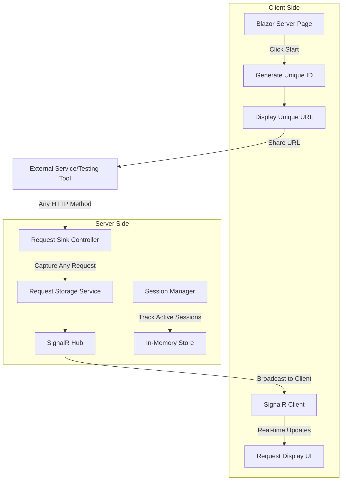

# Universal Request Inspector - Architecture Document

## Overview
The Universal Request Inspector is a Blazor-based web application that allows users to create temporary URL endpoints to capture and inspect HTTP requests in real-time. Similar to services like RequestBin or Webhook.site, it provides developers with a tool to debug webhooks, API integrations, and HTTP communications.

## Core Features
- **One-click URL Generation**: Users click "Start Now" to generate a unique endpoint
- **Universal Request Acceptance**: Accepts ANY HTTP method (GET, POST, PUT, DELETE, OPTIONS, PATCH, etc.)
- **Wildcard Path Support**: Captures requests to any sub-path under the generated endpoint
- **Real-time Updates**: Uses SignalR to instantly display incoming requests
- **Request Details**: Shows headers, body, method, query parameters, and more
- **Session-based**: Each user gets their own isolated request sink

## Architecture

### High-Level Architecture Diagram



### Component Breakdown

#### Frontend Components

1. **Pages/Index.razor**
   - Main page with "Start Now" button
   - Displays generated URL
   - Shows real-time request feed
   - Manages SignalR connection

2. **Components/RequestDisplay.razor**
   - Reusable component to display individual requests
   - Shows method, path, headers, body
   - Collapsible sections for better UX

3. **Components/RequestList.razor**
   - Container for multiple RequestDisplay components
   - Handles scrolling and overflow
   - Implements filtering/searching

#### Backend Components

1. **Controllers/RequestSinkController.cs**
   ```csharp
   [Route("requestsink/{sinkId}/{**path}")]
   [ApiController]
   public class RequestSinkController : ControllerBase
   {
       // Handles all HTTP methods
       // Captures full request details
       // Notifies via SignalR
   }
   ```

2. **Hubs/RequestNotificationHub.cs**
   - SignalR hub for real-time communication
   - Methods: JoinSink, LeaveSink
   - Broadcasts requests to specific sink subscribers

3. **Services/RequestStorageService.cs**
   - In-memory storage for active sinks and requests
   - Manages sink lifecycle
   - Implements cleanup for expired sinks

4. **Models/RequestInfo.cs**
   ```csharp
   public class RequestInfo
   {
       public string Id { get; set; }
       public DateTime Timestamp { get; set; }
       public string Method { get; set; }
       public string Path { get; set; }
       public Dictionary<string, string> Headers { get; set; }
       public string Body { get; set; }
       public Dictionary<string, string> QueryParams { get; set; }
       public string ClientIp { get; set; }
   }
   ```

5. **Models/RequestSink.cs**
   ```csharp
   public class RequestSink
   {
       public string Id { get; set; }
       public DateTime CreatedAt { get; set; }
       public List<RequestInfo> Requests { get; set; }
       public string ConnectionId { get; set; }
   }
   ```

### Technical Implementation Details

#### Routing Configuration
```csharp
// Program.cs
app.MapControllerRoute(
    name: "requestsink",
    pattern: "requestsink/{sinkId}/{**path}",
    defaults: new { controller = "RequestSink", action = "CaptureRequest" }
);
```

#### SignalR Configuration
```csharp
// Program.cs
builder.Services.AddSignalR();
app.MapHub<RequestNotificationHub>("/hubs/requests");
```

#### CORS Configuration
```csharp
// Enable CORS for request sinks to accept from any origin
builder.Services.AddCors(options =>
{
    options.AddPolicy("RequestSinkPolicy",
        builder => builder
            .AllowAnyOrigin()
            .AllowAnyMethod()
            .AllowAnyHeader());
});
```

### Data Flow

1. **Sink Creation**
   - User clicks "Start Now"
   - Frontend generates unique ID (GUID or short code)
   - Creates SignalR connection
   - Joins specific sink group

2. **Request Capture**
   - External service sends request to `/requestsink/{id}/any/path`
   - RequestSinkController captures full request
   - Stores in RequestStorageService
   - Notifies SignalR hub

3. **Real-time Update**
   - SignalR hub broadcasts to sink group
   - Frontend receives notification
   - Updates UI with new request

### Security Considerations

1. **Rate Limiting**: Implement per-IP rate limiting to prevent abuse
2. **Sink Limits**: Maximum requests per sink (e.g., 100)
3. **Expiration**: Auto-expire sinks after inactivity (e.g., 1 hour)
4. **Size Limits**: Maximum request body size (e.g., 1MB)
5. **No Authentication**: By design, sinks are public but obscured by unique IDs

### Scalability Considerations

1. **Current Design**: In-memory storage suitable for single-server deployment
2. **Future Scaling**:
   - Replace in-memory storage with Redis
   - Use Azure SignalR Service for distributed SignalR
   - Implement distributed caching
   - Add database persistence for request history

### URL Examples

- Base URL: `https://yourdomain.com`
- Generated sink: `https://yourdomain.com/requestsink/a1b2c3d4e5f6`
- Accepts all variations:
  - `GET https://yourdomain.com/requestsink/a1b2c3d4e5f6`
  - `POST https://yourdomain.com/requestsink/a1b2c3d4e5f6/api/v1/webhook`
  - `OPTIONS https://yourdomain.com/requestsink/a1b2c3d4e5f6/test/path/here?param=value`

## Implementation Phases

### Phase 1: Core Functionality
- [x] Project setup with Blazor Server
- [ ] Basic UI with Start button
- [ ] Unique ID generation
- [ ] Request capture controller
- [ ] SignalR integration
- [ ] Basic request display

### Phase 2: Enhanced Features
- [ ] Request filtering and search
- [ ] Copy request as cURL
- [ ] Export requests (JSON/HAR)
- [ ] Request replay functionality
- [ ] Dark mode support

### Phase 3: Production Ready
- [ ] Rate limiting
- [ ] Monitoring and analytics
- [ ] Error handling
- [ ] Deployment configuration
- [ ] Documentation

## Technology Stack

- **Frontend**: Blazor Server
- **Real-time**: SignalR
- **Backend**: ASP.NET Core 8.0
- **Storage**: In-memory (with Redis option)
- **Styling**: Bootstrap 5 or Tailwind CSS
- **Icons**: Bootstrap Icons or Font Awesome

## Next Steps

1. Create new Blazor Server project
2. Implement core models and services
3. Set up SignalR hub
4. Create request capture controller
5. Build UI components
6. Test with various HTTP clients